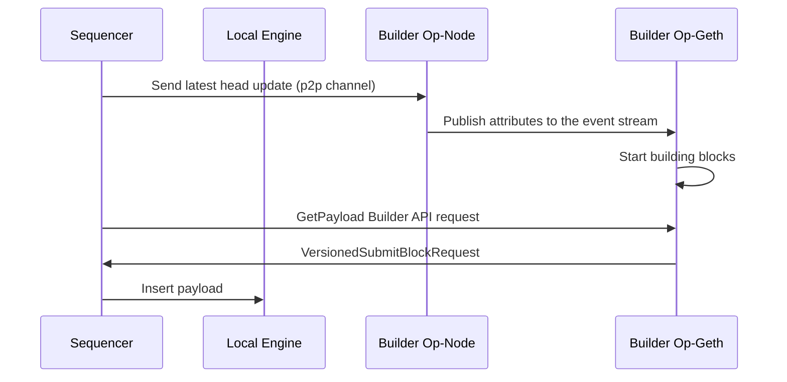

# Flashbots Op-Geth Builder

This is an experimental project that implements the block builder for Optimism, based on [op-geth](https://github.com/ethereum-optimism/op-geth).

## How it works

### GetPayload Builder API

We introduced a new API endpoint in the builder to get the payload for a given slot and parent hash. The sequencer can request the payload from the builder by calling this API and insert the payload to the engine.

#### GET /eth/v1/builder/payload/{slot:[0-9]+}/{parent_hash:0x[a-fA-F0-9]+}

* {slot}: The numerical slot number for which the payload is requested.
* {parent_hash}: The hexadecimal hash of the parent block, prefixed with 0x.

* Response: A JSON object adhering to the [VersionedSubmitBlockRequest](https://github.com/attestantio/go-builder-client/blob/master/spec/versionedsubmitblockrequest.go) schema.

The we are using different payload versions for following optimism fork names:

| Fork Name | Payload Version |
| --------- | --------------- |
| Bedrock   | Bellatrix       |
| Canyon    | Capella         |
| Ecotone   | Deneb           |


### Op-Node modification

Modified version of op-node is required for this builder to work. It is available in our flashbots optimism repository.

Similar to the original beacon chain proposer-builder-separation, op-node publishes attributes to the event stream, from which the builder can pick up the latest head update and start building blocks.

A simplified sequence diagram of the process is as follows:



Key Components:
* Sequencer: Optimism sequencer
* Local Engine: Optimism vanilla op-geth engine.
* Builder Op-Node: Op-node connected to the network to get the latest head update.
* Builder: Flashbots block builder for Optimism.

Process:
1. Sequencer publishes the latest head update in p2p channel
2. Builder Op-Node receives the head update and publishes the attributes to the event stream.
3. Builder listens to the event stream and triggers the build process when the attributes are available.
4. Sequencer requests the builder for the payload by `GetPayload` API.
5. Sequencer inserts the payload to the local engine.

## How to run on devnet.

### Clone the repository

```shell
git clone git@github.com:flashbots/optimism.git
```

### Running with default flashbots/op-geth builder image.

```shell
$ DEVNET_BUILDER=true make devnet-up
```

To additionally enable load testing through [tx-fuzz](https://github.com/MariusVanDerWijden/tx-fuzz), you can run the following command:

```shell
$ DEVNET_LOAD_TEST=true DEVNET_BUILDER=true make devnet-up
```

### Running with custom op-geth builder image.

You first need to build the op-geth docker image with builder API support.

```shell
$ git clone git@github.com:flashbots/op-geth.git
$ cd op-geth
$ docker build . -t <YOUR_OP_GETH_BUILDER_IMAGE>
```

Then you can run the devnet with the following command:

```shell
$ BUILDER_IMAGE=<YOUR_OP_GETH_BUILDER_IMAGE> DEVNET_BUILDER=true make devnet-up
```

## Configuration

These are the configuration options to enable PBS for the devnet.

### Sequencer

There are three flags that configure the sequencer to request payloads from the builder API endpoint:

| Flag                       | Description                                                             | Default Value |
|----------------------------|-------------------------------------------------------------------------|---------------|
| `l2.builder.enabled`       | Enable the builder API request to get payloads built from the builder.  | `false`       |
| `l2.builder.endpoint`      | The URL of the builder API endpoint.                                    | `""`          |
| `l2.builder.timeout`       | The timeout for the builder API request.                                | `500ms`       |

### Builder op-node

The op-geth builder requires the op-node to publish the latest attributes as server-sent events in order to start building the payloads.

| Flag                           | Description                                                                      | Default Value |
|--------------------------------|----------------------------------------------------------------------------------|---------------|
| `sequencer.publish-attributes` | Set to true to enable the sequencer to publish attributes to the event stream.   | `false`       |
| `eventstream.addr`             | The address of the eventstream server.                                           | `127.0.0.1`   |
| `eventstream.port`             | The port of the eventstream server.                                              | `9546`        |

### Builder

These are the builder flags to enable the builder service in op-geth:

| Flag                             | Description                                                                                  | Default Value |
|----------------------------------|----------------------------------------------------------------------------------------------|---------------|
| `builder`                        | Enable the builder service.                                                                  | `false`       |
| `builder.beacon_endpoints`       | The op-node address to get the payload attributes from. Should be set to `builder-op-node`.  | `""`          |
| `builder.block_retry_interval`   | The interval to retry building the payload.                                                  | `500ms`       |
| `builder.block_time`             | Block time of the network.                                                                   | `2s`          |

## Metrics

### Sequencer

The sequencer exposes the builder API related prometheus metrics to the same `/metrics` endpoint of op-node.


| Metric Name                                                  | Description                                                       |
|--------------------------------------------------------------|-------------------------------------------------------------------|
| `op_node_default_sequencer_builder_request_duration_seconds` | The duration of the builder API request.                          |
| `op_node_default_sequencer_builder_request_errors`           | The total number of errors in the builder API request.            |
| `op_node_default_sequencer_builder_request_timeout`          | The total number of builder API requests.                         |
| `op_node_default_sequencer_builder_payloads_bytes`           | The total size of the payloads built by the builder.              |
| `op_node_default_sequencer_profit`                           | The total profit made by the sequencer.                           |
| `op_node_default_sequencer_payload_inserted`                 | The total number of payloads inserted into the local engine.      |
| `op_node_default_sequencer_payload_gas_total`                | The total gas used by the payloads.                               |


# Security

If you find a security vulnerability in this project or any other initiative
related to proposer/builder separation in Ethereum, please let us know sending
an email to security@flashbots.net.

# License

The code in this project is free software under the [LGPL License](COPYING.LESSER).
